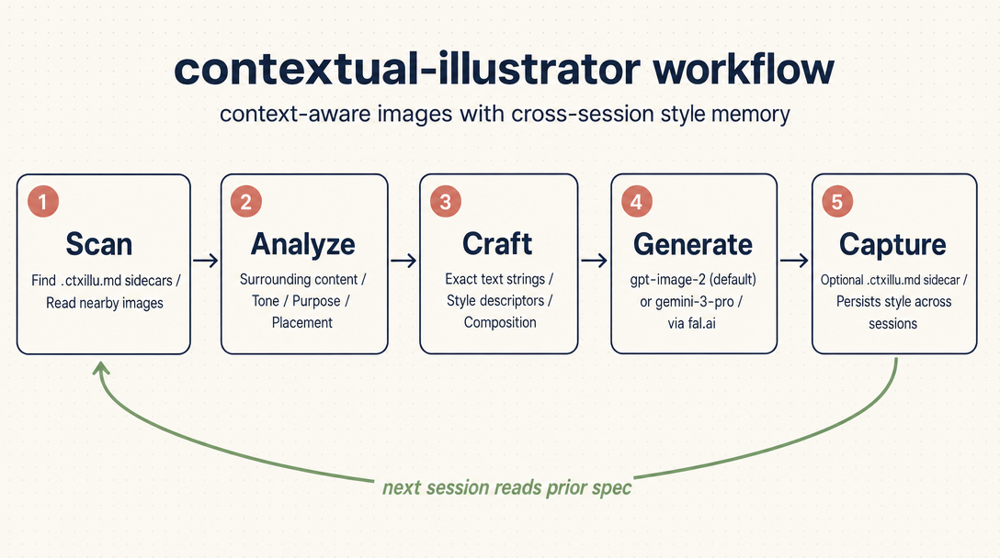

# Contextual Illustrator



Context-aware image generation skill supporting two models with fal.ai and OpenRouter backends:

- **OpenAI GPT-Image-2** (default) — general use, plus fine-grained typography, legible text, signage, UI mockups, and precise mask-based edits. fal.ai only.
- **Gemini 3 Pro Image** — painterly/artistic illustrations, broad stylistic range. fal.ai or OpenRouter. Opt in with `--model gemini-3-pro`.

Analyzes surrounding content (text, tone, existing visuals, audience) to produce images that fit naturally into documents, blog posts, presentations, and more — rather than generating generic results from bare prompts.

## Configuration

Create `.env` in this directory (copy from `.env.example`), configure at least one backend:

```env
# fal.ai (recommended; required for the default gpt-image-2 model)
FAL_KEY=xxxx

# OpenRouter (fallback, Gemini 3 Pro only, no extra Python deps)
OPENROUTER_API_KEY=sk-or-v1-xxxx
```

Get your keys:
- fal.ai: https://fal.ai/dashboard/keys
- OpenRouter: https://openrouter.ai/keys

## Runtimes

Three interchangeable scripts live under `scripts/` — same flags, same JSON output. Pick whichever matches the host:

- `scripts/generate_image.py` — Python 3.10+ with `fal-client` (set up via `uv venv && uv pip install fal-client`)
- `scripts/generate_image.mjs` — Node ≥ 18 or Bun, zero npm deps
- `scripts/generate_image.sh` — bash + `curl` + `jq`, no language runtime needed

The shell version uses fal.ai's sync mode (`https://fal.run/<endpoint>`) for one-shot HTTP — no queue polling.

## How It Works

1. Scans nearby `.ctxillu.md` sidecars for any project-specific style or preferences from prior generations
2. Analyzes the surrounding context — purpose, content, tone, existing visuals
3. Determines appropriate style (explicit → sidecars → inferred → "elegant minimal" default)
4. Crafts a detailed generation prompt incorporating all context, with exact text strings when the image carries text
5. Chooses parameters (aspect ratio, resolution, format) based on placement
6. Generates via `scripts/generate_image.py` and integrates into content
7. For long-lived projects, optionally writes a `.ctxillu.md` sidecar so future images can match

## Style Continuity Across Sessions

For projects with multiple illustrations over time (a repo, blog, doc site, design system), the skill can drop a small `.ctxillu.md` sidecar next to each generated image. The sidecar captures the style descriptors, exact text strings, user preferences, and the prompt used.

Future generations in the same directory pick these up automatically and produce visually consistent companions — solving the "next session starts from scratch" drift problem.

Sidecars are **off by default** — most asks are one-off and don't need the bookkeeping. The skill turns them on by judgment when the work looks long-lived (existing sibling sidecars, expressed preferences, image series, project repo, etc.) and asks once when uncertain.

See `SKILL.md` for the full workflow instructions that Claude follows.
